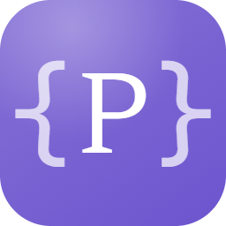

<div align="center">



# Prompt a Porter

**I prompt migliori, pronti da indossare.**

Libreria desktop local-first per i tuoi prompt AI: template parametrici, vault cifrato,
palette globale a portata di hotkey — su Windows, macOS e Linux.

[](https://github.com/robertomarchioro/prompt-a-porter/releases/latest)
[](https://github.com/robertomarchioro/prompt-a-porter/releases)
[](https://github.com/robertomarchioro/prompt-a-porter/actions/workflows/client-build.yml)
[](LICENSE)


**[🌐 Sito](https://www.promptaporter.it/)** ·
**[⬇️ Download](https://github.com/robertomarchioro/prompt-a-porter/releases/latest)** ·
**[📖 Guida rapida](https://www.promptaporter.it/utente/getting-started)** ·
**[📋 Changelog](CHANGELOG.md)**


</div>

---

## Perché

Se usi gli LLM ogni giorno, i tuoi prompt migliori sono capitale — e probabilmente oggi vivono
sparsi tra note, chat e file di testo. Prompt a Porter li mette in un **vault locale**
(cifrabile, senza cloud, senza account), li rende **parametrici** e te li serve **in due
tasti** in qualunque app tu stia lavorando: `Ctrl+Shift+P`, cerchi, compili, incolli. Fine.

```
Scrivi un'email {{tono}} a {{destinatario}} per {{global firma}}…
     └─ compila i segnaposti in un form → copia negli appunti → incolla nella tua chat AI
```

## Funzionalità

| | |
|---|---|
| ⚡ **Palette globale** | Hotkey di sistema stile Raycast/Alfred: cerca, compila e copia senza aprire l'app |
| 🧩 **Template componibili** | Segnaposti `{{nome}}`, valori globali `{{global …}}`, import fra prompt con pinning di versione e variabili scopate (`{{import "x" version=3 with tono=formale}}`) |
| 🔐 **Vault cifrato, local-first** | SQLite + SQLCipher AES-256 (opzionale), nessun cloud, nessuna telemetria, password mai persistita |
| 🔍 **Ricerca ibrida** | Full-text + **ricerca semantica on-device** (embeddings locali, niente API esterne) |
| 🧪 **Test golden** | Casi di regressione per prompt con provider AI reali (Ollama/Anthropic/OpenAI), similarity cosine/regex/LLM-judge e report di drift |
| ⭐ **Qualità misurata** | Rating post-uso, media per prompt, ordinamento "Migliori", varianti A/B e fork tracciati |
| 🩺 **Linter configurabile** | 12 regole (lunghezza, segnaposti, PII, stile, import) con severità e soglie personalizzabili |
| 📦 **Porta i tuoi dati ovunque** | Import/export JSON lossless e Markdown compatibile Obsidian/Foam; cestino con ripristino |
| 🤖 **CLI & MCP** | CLI `pap` per script e pipeline; server MCP per usare il vault da Claude Desktop, Cursor & co. |
| 🔏 **Release firmate** | Authenticode (Windows), Developer ID + notarizzazione (macOS), auto-update verificato Ed25519 |

## Download

Tutte le release: **[github.com/robertomarchioro/prompt-a-porter/releases](https://github.com/robertomarchioro/prompt-a-porter/releases/latest)**

| Piattaforma | Pacchetto |
|---|---|
| **Windows 10/11** | Installer NSIS `…x64-setup.exe` (per-user, niente UAC) oppure `.zip` portable |
| **macOS 12+** | `.dmg` universale (Apple Silicon + Intel), firmato e notarizzato |
| **Linux** | `.AppImage` oppure `.deb` |

Primo avvio in 3 passi: dai un nome al vault → scegli se cifrarlo → imposta la hotkey.
Poi parte il tour guidato. Guida completa: **[getting-started](https://www.promptaporter.it/utente/getting-started)**.

## L'ecosistema

Un monorepo, quattro superfici sullo stesso vault:

| App | Cos'è | Stack |
|---|---|---|
| [`apps/client`](apps/client) | L'app desktop | Tauri 2 · Svelte 5 · TypeScript · CodeMirror 6 |
| [`apps/cli`](apps/cli) | CLI `pap` — list, get, render, completion | Go |
| [`apps/mcp-server`](apps/mcp-server) | 4 tool MCP read-only per i client AI | TypeScript |
| [`apps/server`](apps/server) | Sync di team self-hosted (opzionale, WIP) | Go, single binary |

## Filosofia

- **Local-first davvero**: il vault è un file SQLite sul tuo disco. L'app funziona per sempre anche offline; il sync è un'aggiunta, mai un requisito.
- **I tuoi dati non hanno lock-in**: export JSON round-trip lossless e Markdown leggibile ovunque.
- **Sicurezza verificabile**: codice AGPL, firma su ogni binario, updater che rifiuta firme non valide, CI con audit di sicurezza.

## Contribuire

```bash
git clone https://github.com/robertomarchioro/prompt-a-porter.git
cd prompt-a-porter
pnpm install
pnpm --filter @pap/client dev
```

Prerequisiti: Node 22 LTS, pnpm 9+, Rust stable (Tauri), Go 1.25+ (CLI/server).
Setup completo, convenzioni e mappa CI in [`docs/contribuire/`](docs/contribuire/).
La documentazione tecnica è in 5 cluster sotto [`docs/`](docs/README.md)
(utente · contribuire · architettura · roadmap · operativo).

## Stato e roadmap

Il progetto segue **collezioni stagionali**, come impone il nome:

- **«Ago e Filo»** (v0.8.x) — la collezione corrente: 35+ release, 4 piattaforme, tutto quello che leggi sopra.
- **«Arioso Atelier» (v1.0)** — il debutto in passerella, imminente.
- **Linea Deluxe (v2.0)** — sync multi-device peer-to-peer senza server («Ordito») e versione enterprise database-agnostic. Design già pubblico in [`docs/roadmap/`](docs/roadmap/).

## Licenza

**[GNU AGPL-3.0](LICENSE)** — tutto il codice è libero, ispezionabile e portabile; chi lo
ospita come servizio ha l'obbligo di pubblicare le modifiche.

<div align="center">

---

**Roberto Marchioro** · costruito in coppia con Claude

*Prompt a Porter — perché i prompt migliori meritano di essere riutilizzati.*

</div>
