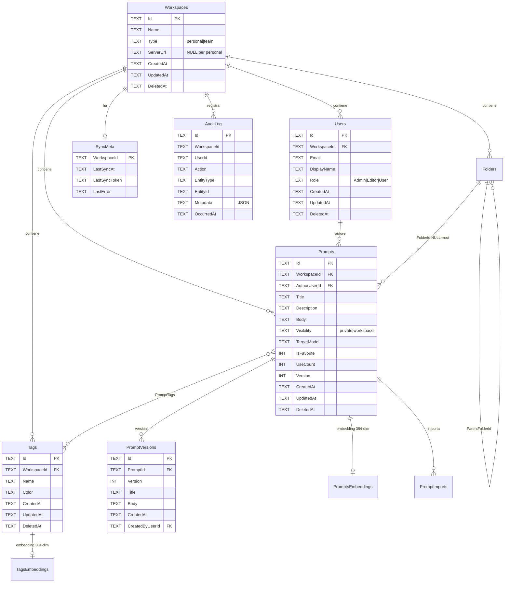

# Schema Dati — Prompt a Porter

## Panoramica

Database SQLite cifrato con **SQLCipher** (AES-256-CBC).
Accesso gestito da `rusqlite` con feature `bundled-sqlcipher`.

### Cifratura

| Componente | Dettaglio |
|------------|-----------|
| Algoritmo | AES-256 via SQLCipher |
| Derivazione chiave | Argon2id (m=32MiB, t=3, p=4) |
| Salt | 16 byte random, salvato in `vault-meta.json` |
| Storage chiave | Mai persistita — derivata dalla password ad ogni unlock |
| Re-key | `PRAGMA rekey` per cambio password senza riscrivere il DB |

### Flusso unlock

```
Password utente
      │
      ▼
 ┌──────────┐     salt (da vault-meta.json)
 │ Argon2id │◄────────────────────────────
 └────┬─────┘
      │ 32 byte
      ▼
 PRAGMA key = "x'<hex>'"
      │
      ▼
 SELECT count(*) FROM sqlite_master  ← verifica chiave
      │
      ▼
 Migrazioni pendenti
      │
      ▼
 Vault aperto ✓
```

## Convenzioni

- **PascalCase** per tabelle e colonne
- **`Id`** come PK: TEXT, formato ULID o UUIDv7
- **Tombstone**: `DeletedAt` TEXT (ISO 8601) per soft delete (necessario per sync)
- **Timestamp**: tutti in formato ISO 8601 UTC
- **Segnaposti**: parsati on-the-fly dal `Body`, non persistiti in tabella separata

## Diagramma ER



## Tabelle

### Workspaces
Unità di scoping. Il workspace `personal` è locale-only, `team` si sincronizza con il server.

### Users
Utenti del workspace. In modalità personale esiste un solo utente con ruolo `Admin`.

### Prompts
Oggetto principale — template parametrici con segnaposti `{{nome}}`.
Il campo `Version` è un contatore incrementale per il conflict resolution durante sync (last-write-wins).

### PromptVersions
Storico versioni. Schema pronto per rollback in Fase 2. In Fase 1 si inserisce solo la v1.

### Tags
Tag piatti, scopati per workspace. Vincolo UNIQUE su (WorkspaceId, Name).

### PromptTags
Relazione N:M tra Prompts e Tags. CASCADE su DELETE di entrambi i lati.

### AuditLog
Log append-only. Chi ha fatto cosa e quando. JSON in `Metadata` per dettagli aggiuntivi.

### SyncMeta
Una riga per workspace: ultimo sync, token cursor, ultimo errore.

### PromptsFts (FTS5)
Tabella virtuale per full-text search su Title, Description, Body, Tags.
Usa `content=''` (contentless) — i dati vanno sincronizzati manualmente via trigger.

### Folders (Fase 3)
Cartelle gerarchiche, una per workspace. `ParentFolderId` può essere
`NULL` (cartella a root). `Path` è denormalizzato come stringa
`/parent/child/...` ricalcolata su sposta/rinomina di sotto-tree —
permette query efficienti tipo `WHERE Path LIKE '/marketing/%'`.

Vincolo: `UNIQUE(WorkspaceId, ParentFolderId, Name)` — nomi
duplicati vietati come fratelli, ammessi cross-tree.

I prompt sono "ubicati" in una sola cartella tramite `Prompts.FolderId`
(`NULL` = a root del workspace). Le cartelle sono ortogonali ai
tag (un prompt → 1 cartella, → N tag).

### PromptsEmbeddings (Fase 3, sqlite-vec)
Tabella virtuale `vec0` (estensione [sqlite-vec](https://github.com/asg017/sqlite-vec))
con vettore 384-dim L2-normalized per ogni prompt indicizzato dalla
ricerca semantica. Schema: `(PromptId TEXT PRIMARY KEY, Embedding FLOAT[384])`.

Auto-extension registrata via `sqlite3_auto_extension` prima del
primo `Connection::open` — vedi
[`sqlite-vec-sqlcipher.md`](./decisioni/sqlite-vec-sqlcipher.md).

Modello: `paraphrase-multilingual-MiniLM-L12-v2` (vedi
[`embedding-model.md`](./decisioni/embedding-model.md)).

### TagsEmbeddings (Fase 3, sqlite-vec)
Stessa struttura di `PromptsEmbeddings` ma su `TagId`. Usato dal
suggeritore semantico di tag nell'editor (Fase 3 Step 4): cerca i
tag più vicini al testo del prompt che si sta scrivendo.

### PromptImports (Fase 3)
Grafo delle dipendenze fra prompt componibili. Una riga per ogni
`{{import "..."}}` parsato dal body del prompt parent.

| Colonna | Tipo | Note |
|---|---|---|
| `ParentPromptId` | TEXT | FK a `Prompts.Id` |
| `Position` | INT | 0-based, ordine di apparizione nel body |
| `ImportedPath` | TEXT | Path letterale dall'import |
| `ImportedPromptId` | TEXT | FK a `Prompts.Id`, `NULL` se non risolto |

Popolata su crea/aggiorna del prompt parent. Permette query "chi
importa X?" in O(1) invece di scansionare tutti i body.

### PromptGoldens (Fase 4)
Casi di test salvati su un prompt. Differenziatore strategico — vedi
[`docs/utente/regression-testing.md`](../utente/regression-testing.md).

| Colonna | Tipo | Note |
|---|---|---|
| `Id` | TEXT PK | `gld-<hex16>` |
| `PromptId` | TEXT FK Prompts | |
| `Etichetta` | TEXT | Nome leggibile (es. "caso comune") |
| `InputVars` | TEXT | JSON delle variabili compilate |
| `ExpectedOutput` | TEXT | |
| `SimilarityFn` | TEXT CHECK | `cosine` \| `llm-judge` \| `exact-match` \| `regex` |
| `SoglieTolleranza` | REAL CHECK [0,1] | Default 0.85 |
| `CreatedAt`/`UpdatedAt` | TEXT | ISO 8601 |
| `DeletedAt` | TEXT | Soft-delete |

### PromptRunObservations (Fase 4)
Storia delle esecuzioni. Append-only.

| Colonna | Tipo | Note |
|---|---|---|
| `Id` | TEXT PK | `obs-<hex16>` |
| `PromptVersionId` | TEXT FK PromptVersions | Versione del prompt al momento del run |
| `GoldenId` | TEXT? FK PromptGoldens | `NULL` per run liberi senza golden |
| `Provider` | TEXT | `anthropic` \| `openai` \| `google` \| `ollama` \| `openai-compat` |
| `Model` | TEXT | Nome modello (es. `claude-sonnet-4.6`) |
| `ActualOutput` | TEXT | Risposta del modello |
| `Similarita` | REAL? | [0,1] — `NULL` solo se errore di calcolo |
| `Passed` | INTEGER | 1 se Similarita ≥ soglia |
| `LatenzaMs`/`TokensUsed`/`CostoStimato` | INT/INT/REAL? | Metriche opzionali |
| `Errore` | TEXT? | Messaggio errore se run fallito |
| `RanAt`/`RanBy` | TEXT/TEXT | Timestamp ISO + UserId |

### ProviderConfig (Fase 4)
Configurazione provider AI per regression testing. Una row per
provider noto. **API key in plaintext nel DB cifrato SQLCipher AES-256**
(no doppia cifratura applicativa).

| Colonna | Tipo | Note |
|---|---|---|
| `Provider` | TEXT PK CHECK | Set chiuso di kind validi |
| `ApiKey` | TEXT? | NULL per Ollama (no key richiesta) |
| `BaseUrl` | TEXT? | Override endpoint ufficiale |
| `DefaultModel` | TEXT? | Suggerimento UI |
| `Abilitato` | INTEGER | 0/1, default 1 |
| `CreatedAt`/`UpdatedAt` | TEXT | ISO 8601 |

UPSERT preserva la chiave esistente se l'utente non la passa
(`api_key=None`) — utile per modificare solo `default_model`.

### Prompts.ParentPromptId / VariantLabel / IsVariant (Fase 4)
Aggiunte come colonne in `Prompts` (V011) per supportare le varianti
A/B testing — vedi [`docs/utente/varianti-prompt.md`](../utente/varianti-prompt.md).

| Colonna | Tipo | Note |
|---|---|---|
| `ParentPromptId` | TEXT? FK Prompts | NULL = prompt principale |
| `VariantLabel` | TEXT? | "B"/"C"/.../"V<N>", NULL per il principale |
| `IsVariant` | INTEGER | 0/1, redondante con `ParentPromptId IS NOT NULL` ma usato per indici |

### Prompts.ForkOfPromptId (Fase 4)
Aggiunta come colonna in `Prompts` (V012) per supportare i fork —
vedi [`docs/utente/fork-prompt.md`](../utente/fork-prompt.md).

| Colonna | Tipo | Note |
|---|---|---|
| `ForkOfPromptId` | TEXT? FK Prompts | NULL = non-fork. Resta valorizzato anche se l'originale è soft-deletato (tracciabilità storica > integrità referenziale) |

### PromptRatings (Fase 4)
Feedback discreto post-uso. Append-only — vedi
[`docs/utente/rating-prompt.md`](../utente/rating-prompt.md).

| Colonna | Tipo | Note |
|---|---|---|
| `Id` | TEXT PK | `rtg-<hex16>` |
| `PromptId` | TEXT FK Prompts | |
| `UserId` | TEXT FK Users | `usr-locale` in single-user |
| `Rating` | INTEGER CHECK | `IN (-1, 0, 1)` |
| `Note` | TEXT? | Whitespace-only → NULL |
| `UsedWithModel` | TEXT? | Es. `claude-sonnet-4.6` |
| `CreatedAt` | TEXT | DEFAULT `datetime('now')` |

Aggregazione media + distribuzione pos/neu/neg via SQL on-the-fly,
nessuna colonna denormalizzata in `Prompts`.

## Indici

| Indice | Tabella | Colonne |
|--------|---------|---------|
| `idx_prompts_workspace` | Prompts | WorkspaceId |
| `idx_prompts_author` | Prompts | AuthorUserId |
| `idx_prompts_updated` | Prompts | UpdatedAt |
| `idx_prompts_deleted` | Prompts | DeletedAt |
| `idx_tags_workspace` | Tags | WorkspaceId |
| `idx_users_workspace` | Users | WorkspaceId |
| `idx_audit_workspace` | AuditLog | WorkspaceId |
| `idx_audit_occurred` | AuditLog | OccurredAt |

## Migrazioni

Sistema di migrazioni versionato. File SQL in `src-tauri/migrations/`, embedded nel binario via `include_str!()`.

| Versione | Nome | Contenuto |
|----------|------|-----------|
| V001 | schema_iniziale | Tutte le tabelle, indici, FTS5 |
| V002 | versioning_completo | Triggers + storico PromptVersions popolato |
| V003 | indici_audit | Indici aggiuntivi su `AuditLog` per query veloci |
| V004 | cartelle | Tabella `Folders` + `Prompts.FolderId` |
| V005 | embeddings | `PromptsEmbeddings` (vec0 sqlite-vec, 384 dim) |
| V006 | tag_embeddings | `TagsEmbeddings` (vec0, 384 dim) |
| V007 | prompt_imports | Tabella `PromptImports` (grafo dipendenze) |
| V008 | prompt_goldens | Tabella `PromptGoldens` (Fase 4 Step 8) |
| V009 | prompt_run_observations | Tabella `PromptRunObservations` |
| V010 | provider_config | Tabella `ProviderConfig` (API keys) |
| V011 | prompt_varianti | `Prompts.ParentPromptId/VariantLabel/IsVariant` (Fase 4 Step 1) |
| V012 | prompt_fork | `Prompts.ForkOfPromptId` (Fase 4 Step 5) |
| V013 | prompt_ratings | Tabella `PromptRatings` (Fase 4 Step 2) |

Tabella `_Migrazioni` nel DB traccia le versioni applicate.
