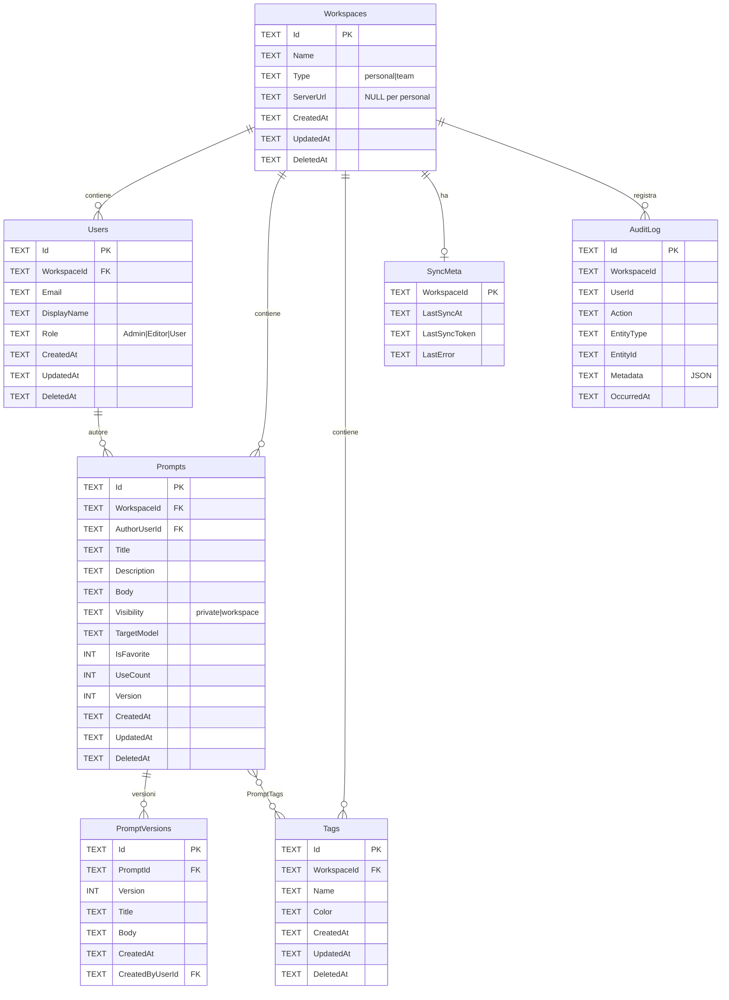

# Schema Dati — Prompt a Porter

## Panoramica

Database SQLite cifrato con **SQLCipher** (AES-256-CBC).
Accesso gestito da `rusqlite` con feature `bundled-sqlcipher`.

### Cifratura

| Componente | Dettaglio |
|------------|-----------|
| Algoritmo | AES-256 via SQLCipher |
| Derivazione chiave | Argon2id (m=32MiB, t=3, p=4) |
| Salt | 16 byte random, salvato in `vault-meta.json` |
| Storage chiave | Mai persistita — derivata dalla password ad ogni unlock |
| Re-key | `PRAGMA rekey` per cambio password senza riscrivere il DB |

### Flusso unlock

```
Password utente
      │
      ▼
 ┌──────────┐     salt (da vault-meta.json)
 │ Argon2id │◄────────────────────────────
 └────┬─────┘
      │ 32 byte
      ▼
 PRAGMA key = "x'<hex>'"
      │
      ▼
 SELECT count(*) FROM sqlite_master  ← verifica chiave
      │
      ▼
 Migrazioni pendenti
      │
      ▼
 Vault aperto ✓
```

## Convenzioni

- **PascalCase** per tabelle e colonne
- **`Id`** come PK: TEXT, formato ULID o UUIDv7
- **Tombstone**: `DeletedAt` TEXT (ISO 8601) per soft delete (necessario per sync)
- **Timestamp**: tutti in formato ISO 8601 UTC
- **Segnaposti**: parsati on-the-fly dal `Body`, non persistiti in tabella separata

## Diagramma ER



## Tabelle

### Workspaces
Unità di scoping. Il workspace `personal` è locale-only, `team` si sincronizza con il server.

### Users
Utenti del workspace. In modalità personale esiste un solo utente con ruolo `Admin`.

### Prompts
Oggetto principale — template parametrici con segnaposti `{{nome}}`.
Il campo `Version` è un contatore incrementale per il conflict resolution durante sync (last-write-wins).

### PromptVersions
Storico versioni. Schema pronto per rollback in Fase 2. In Fase 1 si inserisce solo la v1.

### Tags
Tag piatti, scopati per workspace. Vincolo UNIQUE su (WorkspaceId, Name).

### PromptTags
Relazione N:M tra Prompts e Tags. CASCADE su DELETE di entrambi i lati.

### AuditLog
Log append-only. Chi ha fatto cosa e quando. JSON in `Metadata` per dettagli aggiuntivi.

### SyncMeta
Una riga per workspace: ultimo sync, token cursor, ultimo errore.

### PromptsFts (FTS5)
Tabella virtuale per full-text search su Title, Description, Body, Tags.
Usa `content=''` (contentless) — i dati vanno sincronizzati manualmente via trigger.

## Indici

| Indice | Tabella | Colonne |
|--------|---------|---------|
| `idx_prompts_workspace` | Prompts | WorkspaceId |
| `idx_prompts_author` | Prompts | AuthorUserId |
| `idx_prompts_updated` | Prompts | UpdatedAt |
| `idx_prompts_deleted` | Prompts | DeletedAt |
| `idx_tags_workspace` | Tags | WorkspaceId |
| `idx_users_workspace` | Users | WorkspaceId |
| `idx_audit_workspace` | AuditLog | WorkspaceId |
| `idx_audit_occurred` | AuditLog | OccurredAt |

## Migrazioni

Sistema di migrazioni versionato. File SQL in `src-tauri/migrations/`, embedded nel binario via `include_str!()`.

| Versione | Nome | Contenuto |
|----------|------|-----------|
| V001 | schema_iniziale | Tutte le tabelle, indici, FTS5 |

Tabella `_Migrazioni` nel DB traccia le versioni applicate.
