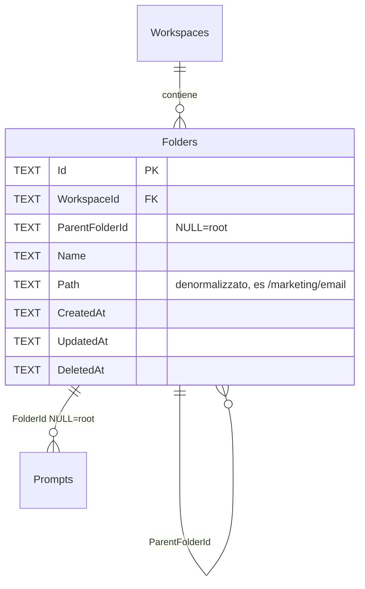

# Cartelle

> Disponibile da `v0.3.0`.

Le **cartelle** sono l'ubicazione canonica di un prompt: ogni
prompt sta in una sola cartella (oppure a *root* del workspace,
quando `FolderId` è `NULL`).

I **tag** restano trasversali (un prompt → molti tag) e sono il modo
giusto per categorizzare per dimensioni ortogonali (tono, scopo,
destinatario). Cartelle e tag risolvono problemi diversi.

## Modello dati

`Path` è **denormalizzato**: contiene la stringa `/parent/child/...`
ricalcolata su sposta/rinomina di sotto-tree. Vincolo invariante:
`Path = parent.Path + "/" + Name`. Sentinella in test
(`docs/operativo/coverage.md` § cartelle).

### Vincoli

- `UNIQUE(WorkspaceId, ParentFolderId, Name)` — nomi duplicati OK fra
  sotto-tree diversi, vietati come fratelli
- `Name`: max 100 caratteri, no `/`, non vuoto
- Profondità: nessun hard limit (lo schema permette N livelli, ma in
  pratica abbiamo testato fino a 5 livelli con 100 cartelle e tutto
  regge senza inconsistenze)
- Soft delete: `DeletedAt` cascata sui discendenti; i prompt nella
  cartella eliminata tornano a root (`FolderId = NULL`)

## UX nel client

La sidebar della Libreria mostra l'albero delle cartelle. Click
destro su una cartella per:

- **Nuovo prompt qui** (crea un prompt direttamente nella cartella)
- **Nuova sottocartella** (rispetta UNIQUE su (parent, name))
- **Rinomina** (propaga `Path` a tutti i discendenti, in transazione)
- **Elimina cartella** (soft delete cascata; conferma esplicita
  perché i prompt dentro tornano a root)

Le cartelle non si spostano fra loro dalla UI (niente drag&drop né
voce "Sposta in..."). I prompt invece si spostano dal loro menu
contestuale > "Sposta in cartella".

### Filtri di lista

Nella Libreria, click su una cartella filtra la lista ai prompt di
quella cartella **e di tutto il suo sotto-albero** (sempre incluso,
non c'è un toggle). L'opzione **Nessuna cartella** mostra i soli
prompt a root.

## Anti-pattern

- **Cartelle troppo profonde** (> 5 livelli): scoraggiate. Già a 5
  livelli stai duplicando informazione che andrebbe in tag. Il
  linter avvisa con `IMP003` quando un import attraversa una
  catena profonda — segnale che la struttura è da appiattire.
- **Stessa cartella per ruoli ortogonali**: se hai cartella
  "marketing" che mescola "email cold", "presentazioni keynote",
  "social copy" — meglio cartella per dominio (cliente/progetto) e
  tag per tipologia.

## Permessi (anteprima Fase 4)

Oggi le cartelle sono visibili a tutti gli utenti del workspace.
La Fase 4 introdurrà ACL per cartella (Reader/Editor/Owner) come
unità minima di permesso, in modo che un team può avere cartelle
private al singolo utente senza dover splittare il workspace.

Lo schema `Folders` è già pensato per questo: `ParentFolderId` permette
sia inheritance dei permessi che override puntuale. Non c'è ancora il
campo `Permissions` ma sarà additivo.

## Comandi Tauri esposti

| Comando | Cosa fa |
|---|---|
| `folder_lista` | Albero piatto con conteggio prompt per cartella |
| `folder_crea` | Crea sotto un parent (o a root) |
| `folder_rinomina` | Cambia `Name` + propaga `Path` ai discendenti |
| `folder_sposta` | Cambia `ParentFolderId` + ricalcola tutti i `Path` |
| `folder_elimina` | Soft delete cascata + sposta prompt a root |
| `prompt_sposta` | Cambia `FolderId` di un prompt |

## Riferimenti

- Implementazione: `apps/client/src-tauri/src/cartelle.rs`
- Test stress: 14 unit test (incluso 100 cartelle depth 5)
- Schema: [`schema-dati.md`](../architettura/schema-dati.md)
